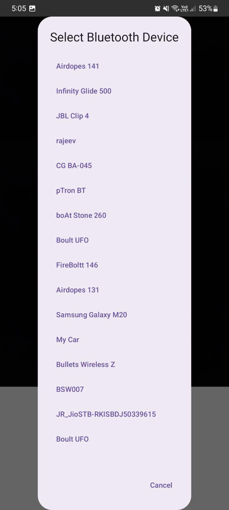
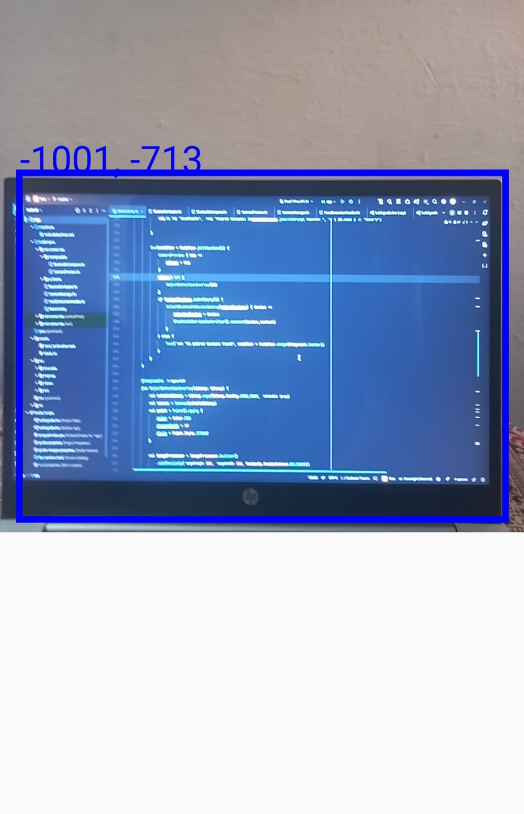
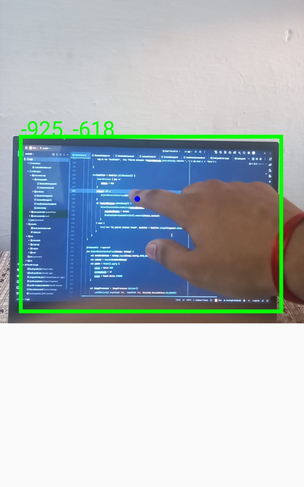

# Rubic (An Accessibility app for touchless Device Control) 

This is an android app build with Jetpack compose and kotlin allowing users to interect with their non-touch sensible device via camera and sending packets through bluetooth.

## Features and uses

 * Connect your phone to your laptop or monitor using Bluetooth.
 * Fix your phone in a stationary position after adjusting the screen alignment for optimal detection.
 * The application uses trained data models and MediaPipe to detect your hand movements and translates them into Bluetooth signals, which are sent to your laptop or monitor for further interaction.
 * It calculates the finger position with respect to screen coordinates and translates them into pixel aspect ratio of monitor.

## 🚧 Project Status
This project is currently under development and is not yet complete. Some features may be missing or incomplete, and the current version may contain bugs.
We are actively working on adding more functionality and improving the trained model for detection.
  Some Bugs :
    * Lowered Frame rate due to high calculations.
    * Screen detecting model is not so much precisely modeled.
    * Bug in Bluetooth connectivity.

##  Samples
   **Bluetooth connectivity :**
   
   Detecting and Pairing bluetooth devices.
   
                                                        

  **Detection :**
  
  Screen detection.
  
         

  Finger and screen detection
  
  
                

  
  
